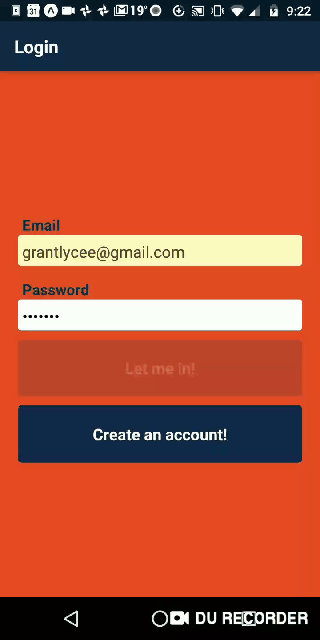

# iFeel

The culmination of technical progress — four billion years of evolution have at last culminated in a social media app capable of providing you with the truly vacuous social interaction and validation that you have been waiting for.

## What Is This and Why the Excellent Clashing Color Scheme?
Specifically, this is a group messaging app that allows people to interact with others using a limited subset of emotions and feign caring about others' emotions with a bot. This is accomplished by limiting the user to posting only from a dropdown of preselected phrases, emojis and emotionally empathetic and supportive responses. This list, compiled by a CS major (who could possibly be more qualified), includes in its twenty-something posts the full possible range of human emotions from "I feel sad" to "I feel very happy". Should actually selecting a message to show that you care about someone else's feelings be too much for you (I mean, you are on the platform to receive validation, not to give it after-all) fear not, for there is the *Bot Button* which will automagically select an emotionally appropriate response (to some approximation) through the marvel that is sentiment analysis.

The inspiration for the name comes from an imaginary app in the novel *The Nix* by Nathan Hill.

As for the color scheme, the answer boils down to a lack of artistic talent rationalized post-hoc as school pride.

## Screen Recording!

*Apologies for the poor screen recording quality*

## Where Did This Come From?
This app was initially a final project for the freshman honors course CS 196 at UIUC.

### Initial team:
Group members

  * Grant Garrett-Grossman
  * Anchit Rao
  * Anna Tan
  * Kshitij Sharma
  * Neil Reddy
  
With Nirmal Prakash as our guiding hand and course assigned Project Manager.

### Now
The project has since been taken up and extended by Grant Garrett-Grossman to bring it to its full potential. Currently, iFeel sports:

  * Multiple groups with everything that entails (creation, modification, and selection being the big visible pieces from the frontend).
  * A navbar replete with buttons decked in homegrown icons to give the user access to this functionality and more.
  * A slide-in scollable menu to select messages from.
  * Upgraded bot functionality making use of sentiment analysis to select a somewhat appropriate response to the last post by another user.

## Getting Started

### Installing and Running

 1. Create a [Firebase](https://firebase.google.com/) account (used for backend), create a project from the Firebase console, and copy the server setup API code and company for web applications into a new file called `api.json` under iFeel-App.
 2. Clone this repository.
 3. [Install Node](https://nodejs.org/en/download/).
 4. Open a terminal in the iFeel-App directory and run `npm install`.
 5. Run `expo start`, fire up an emulator or install the Expo app on your phone
 6. Get your mind blown by this apps awesomeness!

Congrats! You can now use the iFeel app!

*Having Expo also on your phone will help you run and test your app locally. Search "Expo Client" in the App Store or Google Play Store and download the app on your phone.*

***Note:** Right now you can also play around with this app without setting up Firebase for yourself by opening the Expo app, going to Explore, and running iFeel. It will run off of our Firebase project though, so please do not do anything too excessive with it.*

## Built With

  * React-Native: app frontend.
  * GiftedChat: React Native library used to render chat UI (namely message bubbles).
  * Firebase: backend — authentication and storing message, group, and user data in its NoSQL RealTime Database.
  * Sentiment: a Node library that uses some basic natural language processing to assign an emotional valence ranging between -5 and 5 to text and emojis.
  * Node & Expo: Used to run app locally on iOS and/or Android.

## Contributing

Please see list of [contributors](https://github.com/CS196Illinois/iFeel/graphs/contributors) for participants of this project.

We would love to add your name to the list!
